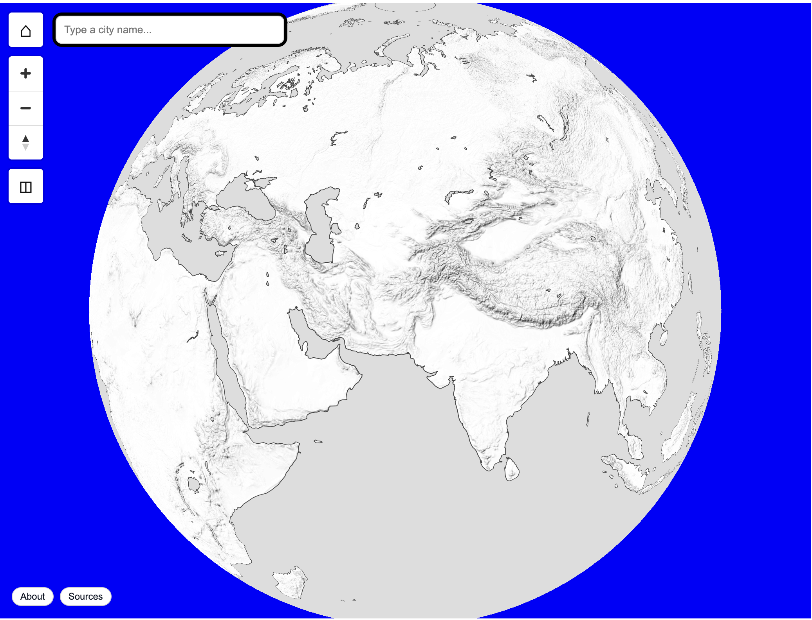
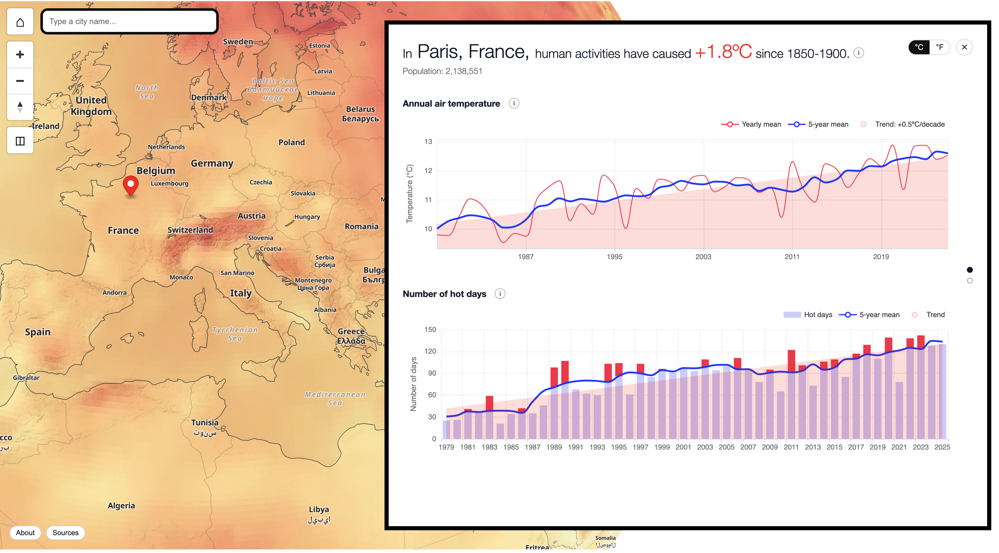

# Climate Data Pipeline + API + Web App

Public app: https://www.placeholder.com

A registry-driven climate data platform with:

- a data packaging pipeline (`scripts/build/packager.py` + `climate/packager/*`)
- shared Python package modules (`climate/`)
- a FastAPI backend (`climate_api/*`)
- a Next.js web application (`web/*`)
- utility scripts for build, validation, benchmarking, and operations (`scripts/`)

## Screenshots




## Repository Organization

- `climate/`: shared package code for dataset derivation, registries, tiles, packager
- `climate_api/`: FastAPI app, schemas, endpoint services
- `data/`: local data artifacts (locations, masks, caches, releases)
- `docs/`: architecture diagrams and runbooks
- `registry/`: authoritative manifests (datasets, metrics, maps, layers, panels)
- `scripts/`: operational build, validation, benchmark, and runtime scripts
- `tests/`: unit/integration/end-to-end test coverage
- `web/`: Next.js frontend application

Pipeline diagrams: [`docs/project_pipeline_diagrams.md`](docs/project_pipeline_diagrams.md)

## Prerequisites

### Python environment (recommended: Conda)

Using Conda (Anaconda or Miniconda) is the recommended path. Create and use a dedicated environment, then run all Python scripts/backend commands from that environment.

```bash
conda create -n <your-env-name> python=3.11
conda activate <your-env-name>
```

Set repo-local import path when running scripts:

```bash
export PYTHONPATH="$(pwd)"
```

You can install packages manually without Conda, but that path is less reproducible and not recommended.

### Node/web environment

Node.js is required for the web application tooling/runtime, and `npm` is required for package management.

```bash
cd web
npm install
```

Optional credentials for ERA5 downloads (`~/.cdsapirc`):

```yaml
url: https://cds.climate.copernicus.eu/api
key: <your-key>
```

## Quickstart

1. Choose a data path:

- Preferred for quick start: use the pre-packaged `demo` release archive (includes locations, masks, and release assets).
- Build-from-scratch path: run the full preparation pipeline (see Data Preparation Overview below).
- The remaining Quickstart steps assume you selected the pre-packaged `demo` release path.

Pre-packaged archive placeholder:

- `TODO` download link: [demo release archive](https://example.com/TODO-demo-release-archive)

2. Start backend:

```bash
./scripts/api_backend.sh
```

3. Start frontend:

```bash
cd web
npm run dev
```

- API: `http://localhost:8001`
- Web: `http://localhost:3000`

## Data Preparation Overview

If you want to create a release from scratch instead of relying on the pre-packaged `demo` release, follow the runbooks below.

Before running the API/UI against local data, prepare:

- location search artifacts and ocean naming masks
- optional reef-domain masks for DHW workflows
- packaged release artifacts (metrics/maps) from dataset caches

Practical note: full global metric production across 40+ years can take days with CDS/ERDDAP sources, especially for daily-variable aggregation workflows (for example air/sea hot-day indicators and coral reef stress indicators).

Disk-space note: a single daily variable over ~40 years is often around 20-80 GB of local cache/output footprint. A realistic multi-metric build commonly needs about 150 GB of free space.

Detailed runbooks:

- [`docs/runbooks/locations-and-ocean-mask.md`](docs/runbooks/locations-and-ocean-mask.md)
- [`docs/runbooks/reef-mask.md`](docs/runbooks/reef-mask.md)
- [`docs/runbooks/dataset-cache-and-packaging.md`](docs/runbooks/dataset-cache-and-packaging.md)

## Documentation Index

| Task                                               | Runbook                                                                                        |
| -------------------------------------------------- | ---------------------------------------------------------------------------------------------- |
| Prepare locations + ocean masks                    | [`docs/runbooks/locations-and-ocean-mask.md`](docs/runbooks/locations-and-ocean-mask.md)       |
| Rebuild reef-domain masks                          | [`docs/runbooks/reef-mask.md`](docs/runbooks/reef-mask.md)                                     |
| Build dataset caches, package metrics/maps         | [`docs/runbooks/dataset-cache-and-packaging.md`](docs/runbooks/dataset-cache-and-packaging.md) |
| Run backend + frontend (with optional Redis cache) | [`docs/runbooks/backend-frontend.md`](docs/runbooks/backend-frontend.md)                       |
| Validate registry/data/tests/smoke checks          | [`docs/runbooks/validation.md`](docs/runbooks/validation.md)                                   |
| Understand concepts, grids, and acronyms           | [`docs/concepts-and-glossary.md`](docs/concepts-and-glossary.md)                               |

For day-to-day development, keep this README as orientation and use runbooks for operational details.
