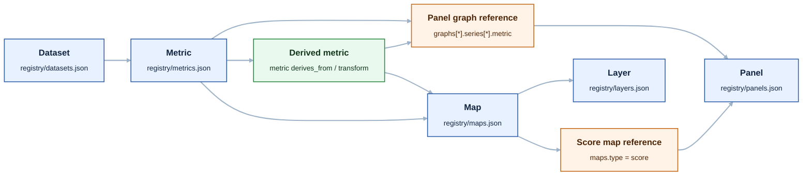
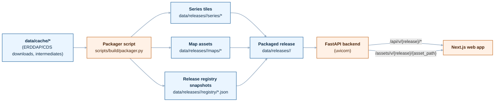
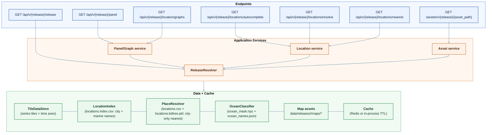
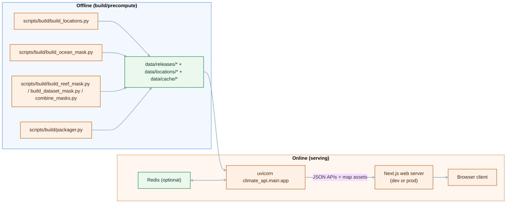

# Climate Project Pipeline Diagrams

These diagrams use Mermaid and render natively on GitHub.

## Graph 1: Registry Relationships

## Graph 2: Data Artifacts Flow (Build to Runtime)

## Graph 3: API Endpoints and Data Sources (Simplified)

## Graph 4: Runtime Topology (Offline vs Online)

